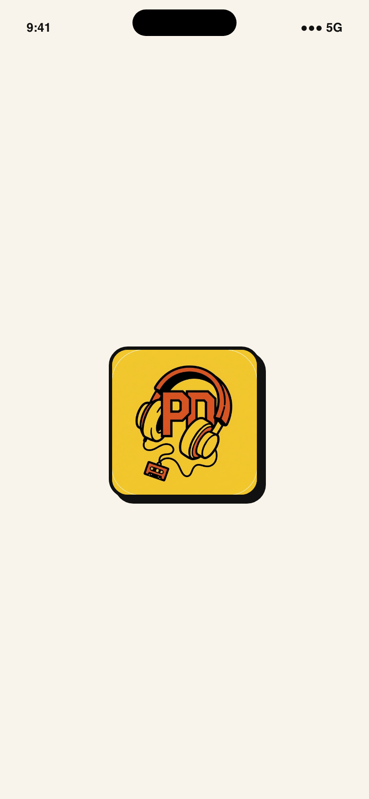
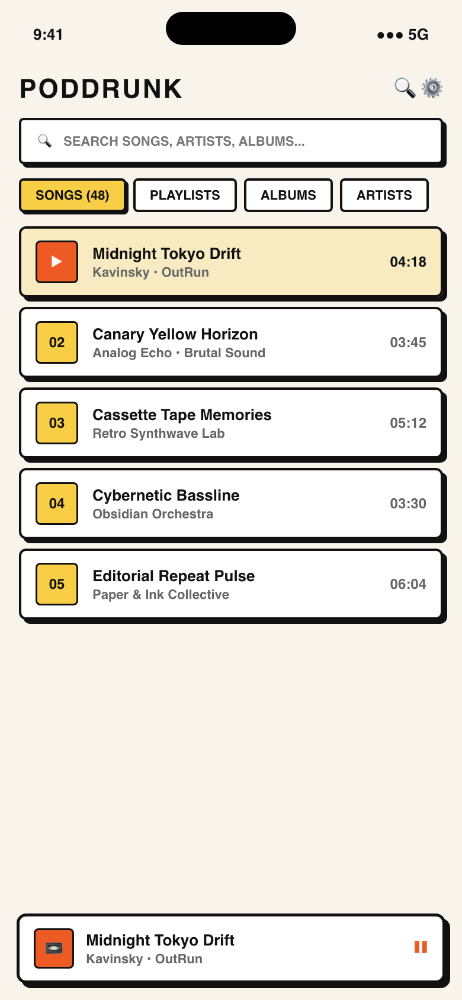
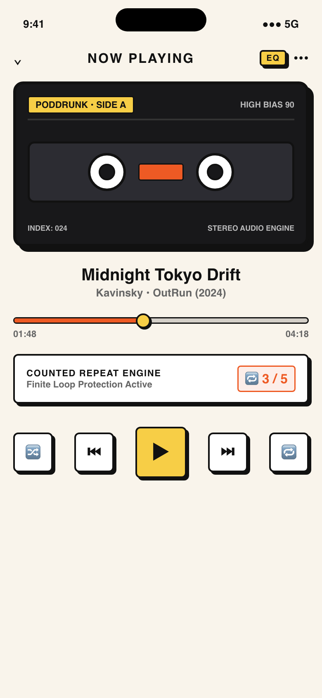
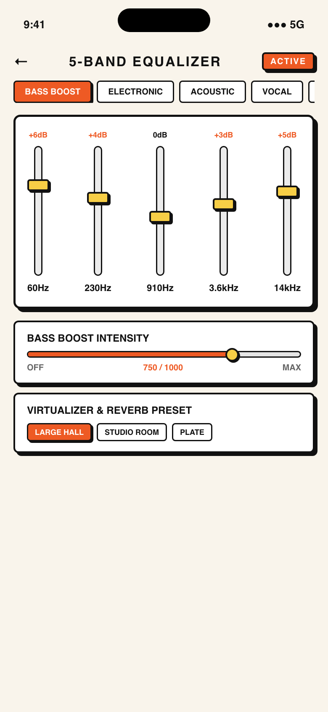
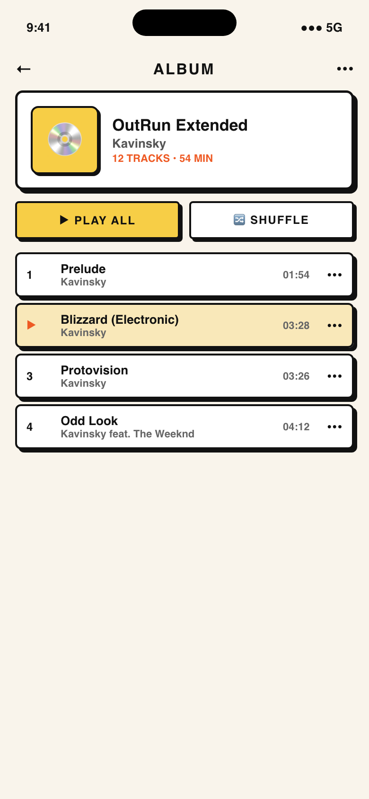
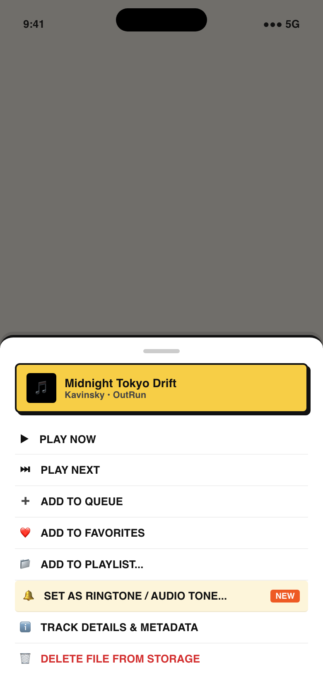
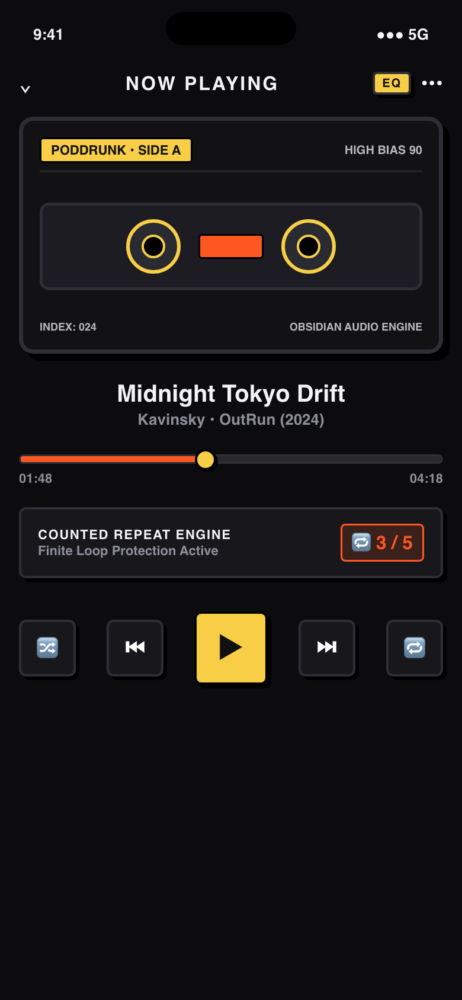
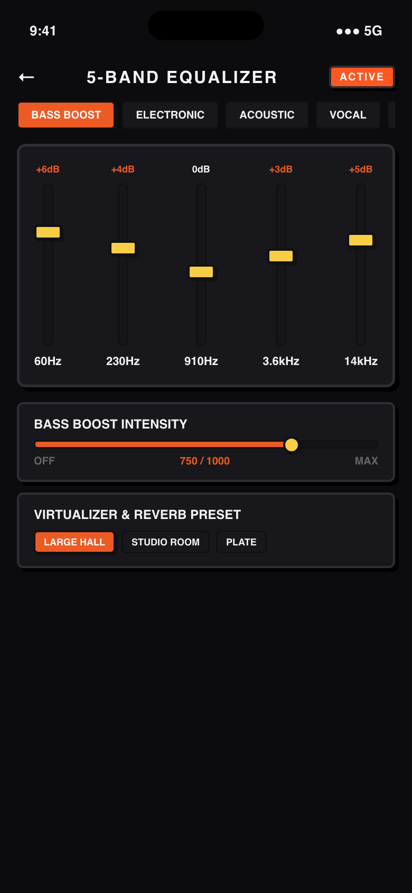

# 📻 Poddrunk

<div align="center">


**A high-energy, Neo-Brutalist offline music player for Android.**  
*Raw typography, stark contrast shadows, tactile haptics, and zero tracking.*

[Download Latest APK](https://github.com/paperlinkos/poddrunk/releases/latest) • [Features](#-features) • [Screenshots](#-screenshots) • [Installation](#-installation) • [Contributing](#-contributing)

</div>

---

## ⚡ Highlights

- **🎨 Uncompromising Neo-Brutalism:** Thick black borders, vibrant pop color blocks, hard-edge drop shadows, and brutalist card aesthetics.
- **🌓 Dual-Theme Engine:** Switch seamlessly between Neo-Brutalist Cream Paper (`#F9F4EB`) and High-Contrast Midnight Noir (`#0E0E10`).
- **🎛️ 5-Band Hardware Equalizer:** Fine-tune audio frequencies with dedicated Bass Boost, Virtualizer, and audio presets (Rock, Pop, Jazz, Electronic, Vocal).
- **🔔 Ringtone & Tone Setter:** Set any track from your library directly as your Phone Ringtone, Notification Tone, or Alarm via native Android integration.
- **📁 Smart Local Library:** Auto-scans local audio files and categorizes them by Songs, Playlists, Albums, and Artists.
- **🔒 100% Offline & Private:** Zero analytics, zero accounts, no internet access required. Your music stays strictly on your device.

---

## 📱 Screenshots

<div align="center">
  
  
  
  
</div>

<div align="center" style="margin-top: 10px;">
  
  
  
  
</div>

---

## 🚀 Download & Installation

### Option 1: Direct APK Download (Free)
1. Go to the **[Releases](https://github.com/paperlinkos/poddrunk/releases)** page.
2. Download the latest `app-release.apk`.
3. Open the file on your Android device and tap **Install** (allow *Install Unknown Apps* if prompted).

### Option 2: Build From Source

#### Prerequisites
- [Flutter SDK](https://docs.flutter.dev/get-started/install) (3.x or newer)
- Android Studio / Android SDK (API 34+)
- Java 17

#### Setup
```bash
# 1. Clone the repository
git clone https://github.com/paperlinkos/poddrunk.git
cd poddrunk

# 2. Install Flutter packages
flutter pub get

# 3. Run on your connected device or emulator
flutter run

# 4. Or build a release APK
flutter build apk --release
```
The compiled APK will be located at:
`build/app/outputs/flutter-apk/app-release.apk`

---

## 🏗️ Architecture & Tech Stack

- **Framework:** [Flutter](https://flutter.dev) & [Dart](https://dart.dev)
- **Audio Engine:** `just_audio` & `audio_service` for low-latency playback and background notification media sessions.
- **Local Storage / Metadata:** `on_audio_query` for querying device media files and album art cache.
- **State Management:** `provider`
- **Native Android Plugins:** Custom Kotlin `MethodChannel` (`com.neobrutalism.poddrunk/ringtone`) for setting ringtones and managing `android.permission.WRITE_SETTINGS`.

---

## 🤝 Contributing & Custom Builds

Contributions are warmly welcomed!
1. **Fork** the repository.
2. Create your feature branch (`git checkout -b feature/AmazingFeature`).
3. Commit your changes (`git commit -m 'Add some AmazingFeature'`).
4. Push to the branch (`git push origin feature/AmazingFeature`).
5. Open a **Pull Request**.

---

## 💼 Work Inquiries & Custom Builds

Need a custom mobile app built, bespoke features added to Poddrunk, or exploring a design collaboration?
- **Email:** [paperlinkos@gmail.com](mailto:paperlinkos@gmail.com)
- **GitHub:** [@paperlinkos](https://github.com/paperlinkos)

---

## ☕ Support & Donations

If you love Poddrunk and want to support ongoing independent, ad-free, open-source development:
- **Ko-fi:** [ko-fi.com/paperlinkos](https://ko-fi.com/paperlinkos) *(0% platform fee for creators)*
- **Buy Me a Coffee:** [buymeacoffee.com/paperlinkos](https://buymeacoffee.com/paperlinkos)
- **Direct Inquiry:** [paperlinkos@gmail.com](mailto:paperlinkos@gmail.com)

---

## 📄 License

Distributed under the **MIT License**. See [`LICENSE`](LICENSE) for more information.

---

<div align="center">
  <b>Built with ❤️ and rebellious energy by Paperlink OS.</b>
</div>
